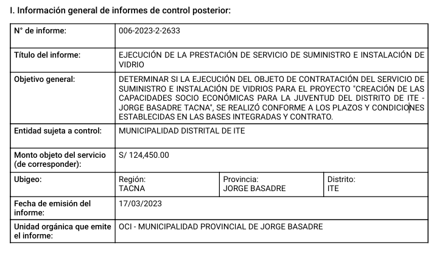
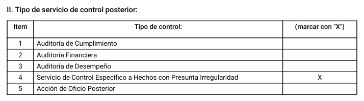

# Parser of PDF Tables from CGR Reports

This repository contains the scripts to parse table 1 and table 2 from the "fichas resumen" that is associated with a Servicio de control. While the table 1 scripts are completed, there is still pending work on table 2 to parse some formats that were not easy to generalize. 

The data these scripts take as input was obtained using the scripts from [claims_processing/pdf_metadata_miner](https://github.com/cgr-bid-columbia/claims_processing)

As step 0, remember to always create a virtual environment. The python version and packages are specified in `runtime.txt` and `requirements.txt`, respectively.

# Table 1




## Pipeline

1. 01_table_1_parser
2. 02_table_1_formatter
3. 03_table_1_writer
4. 04_table_1_fuzzy_merge
5. 05_table_1_merging_codes

### 01_table_1_parser

_Requirements_: tqdm, glob, itertools, pandas, os, math, json, logging

Assumes that all extracted table 1 files didn't lose data, but that it's disorganized and placed in columns and rows where it doesn't belong.

Using the indexes of all empty cells in the file, we were able to detect the errors and fix the issue for almost all ~170000 files.

It's output is a csv with the parsed data of table 1 and a csv reporting all files that were successfully parsed

### 02_table_1_formatter

_Requirements_: tqdm, glob, itertools, pandas, os, math, json, logging

The output of 01_table_1_parser contains two columns: name and value. They both contain the name of each entry in the original table as well as it's original value. However, the format in which we need the data is such that each entry is stored as a variable. 

This script creates those variables when possible and leaves empty the ones where a value could not be found. 

Its output is stored as a csv and an output report is created to determine at a file level which variables were not possible to format and how many of the original entries were formatted successfully.

### 03_table_1_writer

_Requirements_: psycopg2, tqdm, glob, itertools, pandas, os, math, json, logging

Once the data was successfully formatted, we need to store it in our Amazon servers. To do so, we use this script, which writes row per row all the elements that come from `02_table_1_formatter` on  

- "database_table_1": "complaints_project,
"schema_table_1": "public",
- table_table_1": "table_1_reports_metatada"

This script needs a file called `paths.json` containing the credentials to access Amazon and write the data on the right table. It should be structured like this:

```json
{
    "input_path": "",
    "output_path": "",
    "num_jobs": "",
    "batch_id": "",
    "host": "",
    "database_public_firms": "",
    "user": "",
    "password": "",
    "schema_public_firms": "",
    "table_public_firms": "",
    "database_table_1": "",
    "schema_table_1": "",
    "table_table_1": ""
}
```

### 04_table_1_fuzzy_merge

_Requirements_: pandas, numpy, psycopg2, json, datetime, tqdm, pickle, matplotlib, fuzzywuzzy

As each Servicio de Control involves a public entity, we want to obtain the entity code so that we can match this data with datasets containing information about the entity.

We match the entities we found in table 1 with the master dataset plus additional ones that come from the Peruvian ministery of economy and that contain the entity codes using a _fuzzy merge_: if the name of an entity in table one is close to the one from another entity (levensthein distance), we consider it a match


### 05_table_1_merging_codes

_Requirements_: pandas, numpy, aux_tools, psycopg2, json, datetime, tqdm, matplotlib, fuzzywuzzy

Finally, we use the output of the fuzzy merge to use the matched names from the ministery of economy to recover the entity codes.

This and script 04 have a success rate of 99.06% (percentage of matched data)

# Table 2



In contrast with table 1, table 2 only has a single script in charge of the parsing. 

- It detects the format in which the data is organized in the original file
- Based on the detected format, it'll rearrange it such that the final output is a csv containing the name of each entry and its value

Currently, it is capable of finding the most common formats the data has with a success rate for parsing and detecting the type of Servicio de Control of 78.69%

The next steps involve determining how to parse the other formats found.

# Cluster Setup

The following scripts are ready to be deployed on the cluster

1. 01_table_1_parser
2. 02_table_1_formatter
3. table_2_parser

In order to do so, modify the following template and store it as a .sh in the cluster

```bash
#SBATCH --account=sscc             # Social sciences account
#SBATCH --job-name=pdf_metadata      # The job name.
#SBATCH --cpus-per-task=3          # The number of cpu cores to use per task/job
#SBATCH -t 0-20:00                 # Runtime in D-HH:MM
#SBATCH --mem-per-cpu=3gb         # Memory per cpu core (change it according to the cluster limitations)
#SBATCH --array=1-1000             # Number of parallel jobs (change it according to the cluster limitations). The first element should always be 1

source ~/.bashrc
module load anaconda/3-2021.11
source activate name_of_your_env

echo "-- running file --"
python3 /burg/home/mg4558/michael/denuncias/repos/name_of_the_repo/name_of_the_script
echo "-- completed run --"
```

